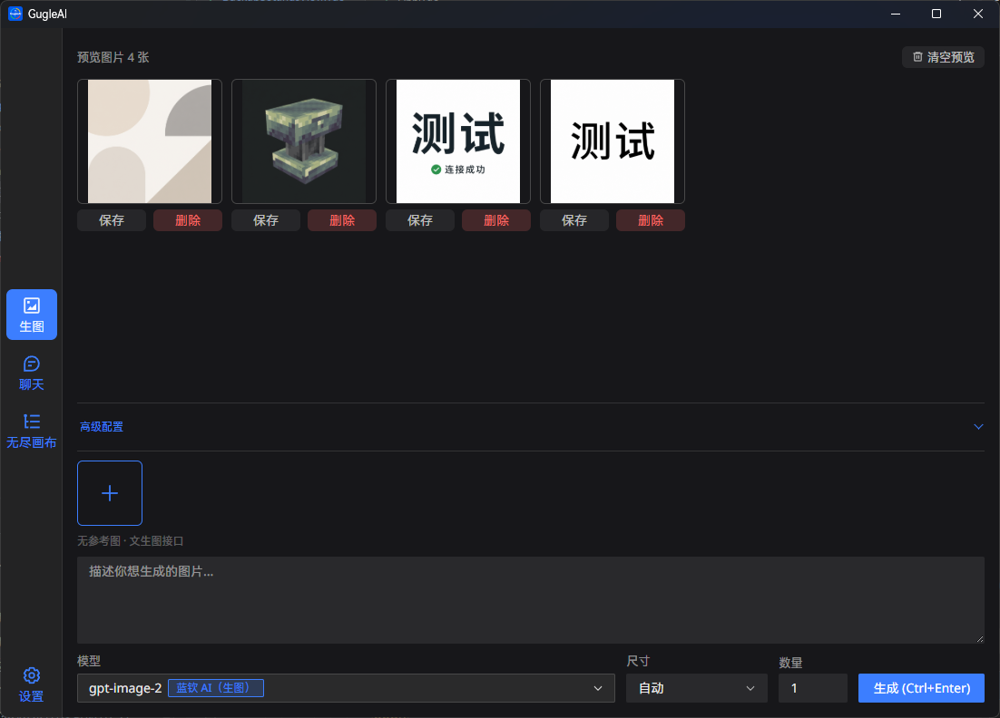
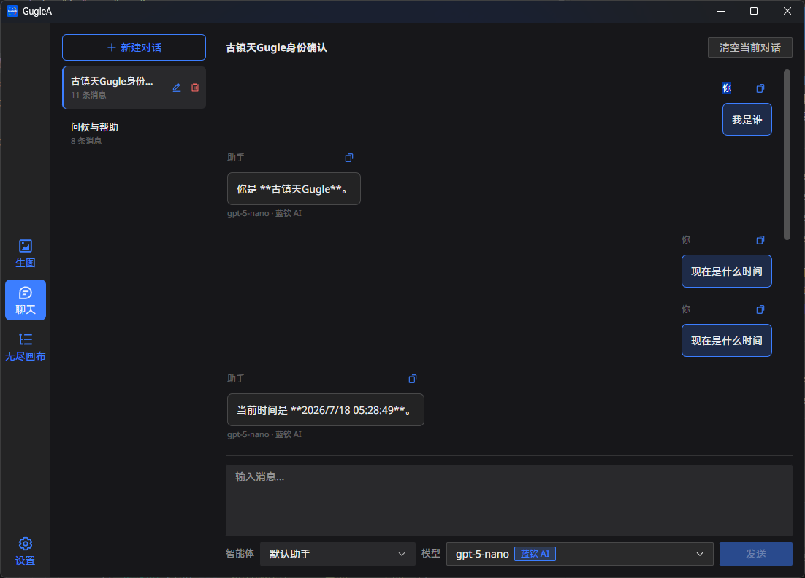
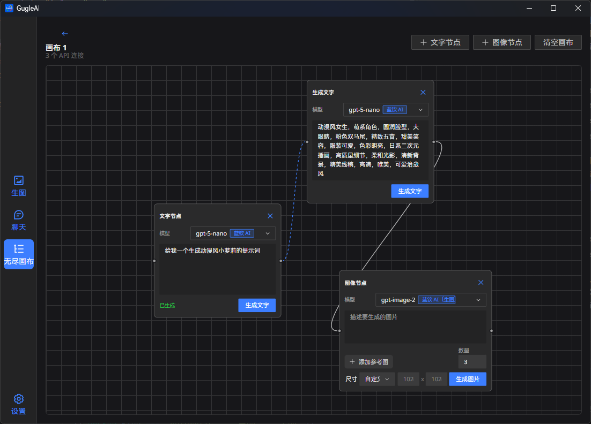
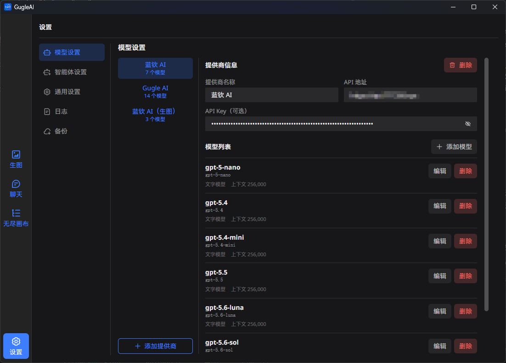
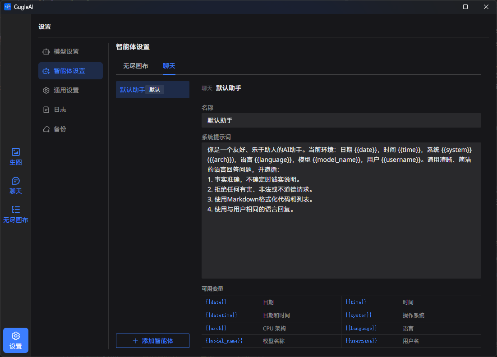
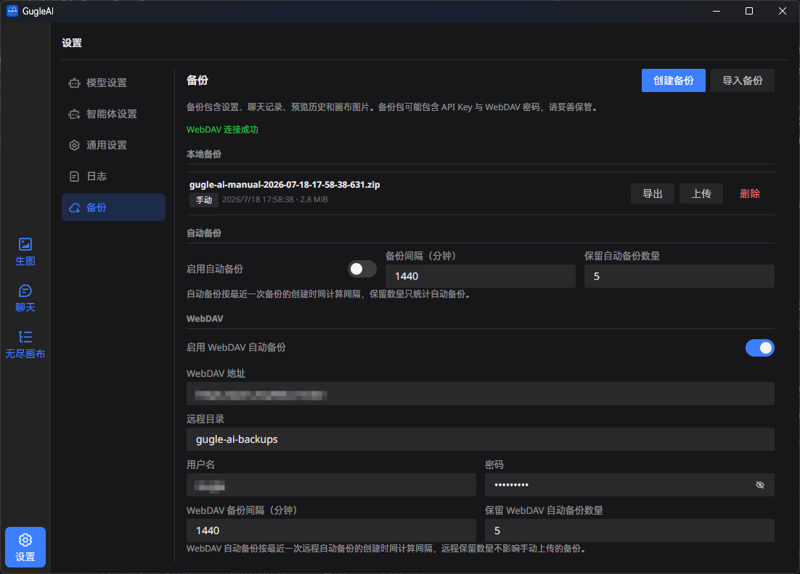

<div align="center">


# GugleAI

[English](README.en.md) | 简体中文

</div>

GugleAI 是一个基于 Tauri 2、Vue 3 和 TypeScript 的桌面与 Android AI 工作台，兼容 OpenAI 风格的图像和聊天接口，也支持配置第三方中转服务。

## 界面预览

|                   图像生成                    |                        文字聊天                        |
|:---------------------------------------------:|:------------------------------------------------------:|
|      |                |
|                 **无尽画布**                  |                      **模型设置**                      |
|     |             |
|                **智能体设置**                 |                      **备份设置**                      |
|  |  |

## 功能

### 三个工作区

- **图像生成**：输入提示词生成图片，支持模型、尺寸、数量和自定义宽高；参考图可以通过文件选择、拖拽或剪贴板粘贴添加。
- **文字聊天**：使用 `/chat/completions` 进行持久化多会话对话，支持新建、重命名、删除、清空和复制消息；助手消息显示实际使用的模型，首轮对话可以异步生成标题。
- **无尽画布**：从画布库新建或打开文档，组合文字节点和图像节点，通过连线把文字和参考图传给生成任务；节点、图片、连线和视口会按画布保存。

### 提供商、模型和设置

- 在模型设置中维护多个提供商，每个提供商拥有独立的名称、API 地址、API Key 和模型列表；切换未保存的提供商信息时会提示保存、放弃或继续编辑。
- 模型支持 ID、显示名称、介绍、生图模型标记和上下文长度。图像生成、聊天、对话标题和画布节点均按提供商分组选择模型。
- 在图像生成页面按 `Ctrl+V` 可以直接导入连接配置，支持 newapi 渠道 JSON（`_type: "newapi_channel_conn"`）和 Codex CLI
  `config.toml` 中的 `base_url`。
- 设置页包含模型、智能体、通用、日志和备份五个子页面。通用设置支持用户名、浅色/深色/跟随系统主题、对话标题模型和启动时自动检查更新。
- 窄屏和 Android 使用避让系统安全区的底部工作区导航；设置采用分类、提供商和详情的分级页面。聊天会话列表使用侧滑抽屉，模型和智能体收进向上覆盖消息区的高级配置；生图将参考图、提示词和生成按钮吸附在底部，模型、尺寸和数量收进向上覆盖预览区的高级配置；无尽画布编辑器全屏显示，左上悬浮返回和画布名称，右上通过圆形加号展开节点与清空操作。
- 智能体设置可以编辑默认助手、添加或删除聊天智能体，并修改无尽画布的提示词生成规则。系统提示词支持 `{{date}}`、`{{time}}`、
  `{{datetime}}`、`{{system}}`、`{{arch}}`、`{{language}}`、`{{model_name}}` 和 `{{username}}` 变量。

### 生成控制和结果管理

- 高级配置提供自动、Images 接口和 Chat 接口三种模式。自动模式下，多参考图请求自动使用 Chat 接口，以兼容只支持单图 `edits`
  的服务。
- 生成任务可以随时停止，同时取消当前请求、重试等待和结果下载。
- 预览历史存储图片和提示词，重启后自动恢复；支持双击放大、复制图片或提示词、设为参考图、保存、删除和清空。
- 结果解析兼容 `b64_json`、绝对或相对图片 URL、Chat 消息中的图片 URL 和内嵌 base64。
- 自动重试默认关闭，只用于生成请求；默认重试状态码为 `[504]`，默认最多重试 5 次，也可以在高级配置中选择或添加 100–599
  范围内的状态码。

### 无尽画布细节

- 画布库支持新建、打开、重命名和确认删除。
- 文字节点可以生成文字子节点，图像节点可以添加或替换参考图，并为每个生图节点单独选择自动、预设或自定义尺寸；生成时只读取直接相连的上游节点。
- 手动连线和自动连线使用不同样式，手动连线可以双击断开；节点图片支持复制提示词、复制图片和保存。
- 画布默认以 60% 缩放打开，当前视口和编辑内容会持续保存。

### 日志、备份和代理

- 诊断日志记录任务编号、阶段、耗时、请求体大小、代理状态和脱敏后的错误详情；应用启动或日志文件超过 100 KB 时自动轮转。
- 本地备份将设置、智能体、聊天记录、预览历史和画布图片打包为 ZIP，支持手动备份、自动备份、导入、导出和删除。导入会覆盖当前对应数据并重新加载应用。
- WebDAV 支持测试连接、上传本地备份、列出或下载远程备份，以及直接从远程 ZIP 恢复；本地与 WebDAV
  自动备份分别配置启用状态、间隔和保留数量，且两端只按各自策略清理自动备份。
- 所有网络请求经过 Tauri HTTP 封装并应用系统代理；日志会隐藏 API Key、Authorization、密码、Token、查询参数和长 base64 数据。

## API 兼容性

- 提供商地址没有版本路径时，应用自动补充 `/v1`；已有 `/v1`、`/v2` 等版本路径以及第三方中转路径会保留。
- 无参考图的 Images 模式调用 `/images/generations`。
- 带参考图的 Images 模式调用 `/images/edits`。
- Chat 模式调用 `/chat/completions`，并从文本、图片 URL 或内嵌 base64 中解析结果。
- 相对图片 URL 会根据提供商地址尝试下载，绝对 URL 也可以直接使用。
- 更新检查和结果下载不会使用生成请求的自动重试机制。

## 快速开始

### 环境要求

- [Node.js 20.19 或更高版本](https://nodejs.org/)
- [pnpm](https://pnpm.io/)
- [Rust](https://www.rust-lang.org/)
- 构建 Android 时还需要 JDK 17、Android SDK、NDK 和 `aarch64-linux-android` Rust target

项目使用 `pnpm` 管理前端依赖，使用 Cargo 管理 Rust 依赖，请不要混用 npm、Yarn 或其他锁文件。

### 安装和运行

```bash
# 安装依赖
pnpm install

# 启动 Tauri 桌面开发模式
pnpm tauri dev

# 仅检查并构建前端
pnpm build

# 构建桌面安装包
pnpm tauri build

# 首次初始化 Android 工程
pnpm tauri android init

# 构建 Android arm64 APK
pnpm tauri android build --target aarch64 --apk
```

Android 发布工作流使用 `ANDROID_KEYSTORE_BASE64`、`ANDROID_KEYSTORE_PASSWORD`、`ANDROID_KEY_ALIAS` 和
`ANDROID_KEY_PASSWORD` 四个 GitHub Actions Secrets 签名 APK。未配置完整签名信息时，桌面发布仍会继续，但会跳过 Android 构建和上传。

首次运行后，在“设置 → 模型设置”中添加提供商，填写 API 地址和 API Key，再添加或编辑模型即可开始使用。

## 使用流程

1. 添加提供商并保存模型列表。API 地址可以填写裸域名，应用会自动补充版本路径。
2. 在图像生成、文字聊天或无尽画布中，从按提供商分组的列表选择模型。
3. 图像生成页面可展开“高级配置”选择接口模式和重试规则，使用 `Ctrl+Enter` 提交生成或聊天消息。
4. 在聊天页面管理多个会话并选择智能体；在无尽画布中创建节点、连接上下游并分别生成文字或图像。
5. 从预览历史的右键菜单复制、复用、保存或删除结果；需要迁移数据时，在备份页面导出 ZIP 或使用 WebDAV。

## 项目结构

```text
src/
├─ views/                    # 图像、聊天、画布和设置页面
├─ router/                   # Vue Router Hash History 路由
├─ composables/controller/   # 组合依赖并提供统一视图模型
├─ composables/fetch/        # Tauri HTTP 请求封装和系统代理
├─ composables/workspace/    # 图像、聊天和画布工作区状态
├─ composables/settings/     # 提供商、生成、应用和智能体设置
├─ services/transport/       # Images、Edits、Chat 请求和响应解析
├─ services/history/         # IndexedDB 预览历史
├─ services/canvas-storage/  # IndexedDB 画布文档
├─ services/backup/          # ZIP 备份和恢复
├─ domain/                   # 共享模型、默认值和规范化工具
├─ api/、chat/、canvas/      # API、聊天和画布领域对象
└─ styles/                   # 应用、设置和各工作区样式
src-tauri/
├─ src/lib.rs                # 保存文件、日志轮转和系统代理命令
├─ capabilities/             # Tauri 最小权限配置
├─ icons/android/            # Android launcher 图标源文件
├─ tauri.android.conf.json   # Android 构建前图标同步配置
└─ tauri.conf.json           # 应用和构建配置
```

`src/App.vue` 负责应用壳层、路由出口和全局弹层；具体页面位于 `src/views/`，网络请求统一经过
`src/composables/fetch/index.ts`。

## 数据与安全

- 提供商、模型、生成参数、主题、智能体和聊天记录保存在本地；预览历史、画布文档和备份使用 IndexedDB。
- 备份包可能包含 API Key、WebDAV 用户名和密码，请像保护凭据一样保存和传输备份文件。
- 应用不会在诊断日志中记录完整 Authorization、API Key 或长 base64 内容；分享日志前仍应检查其中的服务地址和错误信息。

## 下载

前往 [Releases](../../releases) 下载对应平台的安装包。发布构建支持 Windows（x86、x86_64、arm64）、Linux（x86_64、arm64）、
macOS（Intel、Apple Silicon）和 Android（arm64 APK）。

## 许可证

本项目基于 [GNU Lesser General Public License v3.0](LICENSE) 开源。
